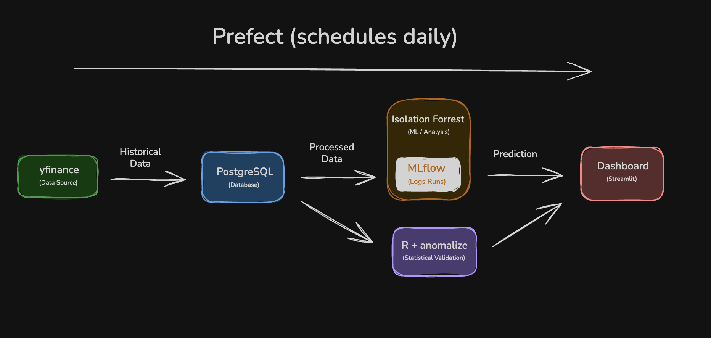
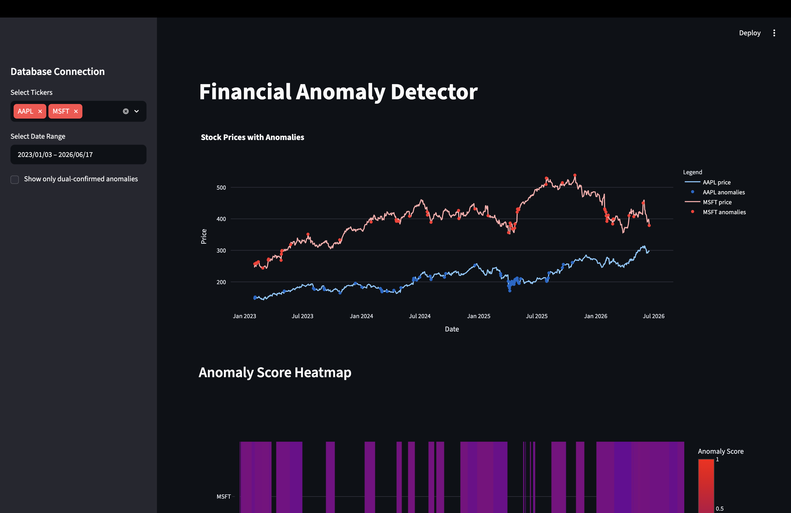
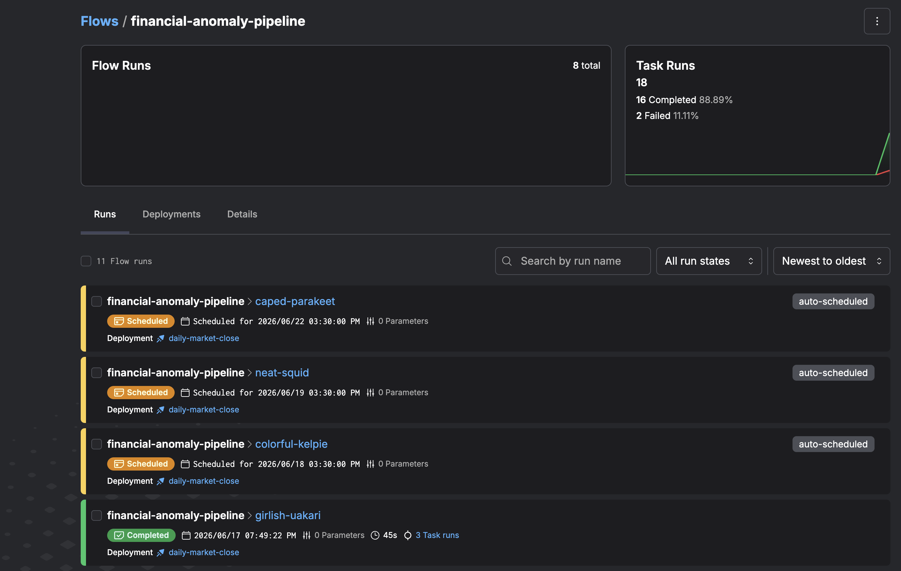
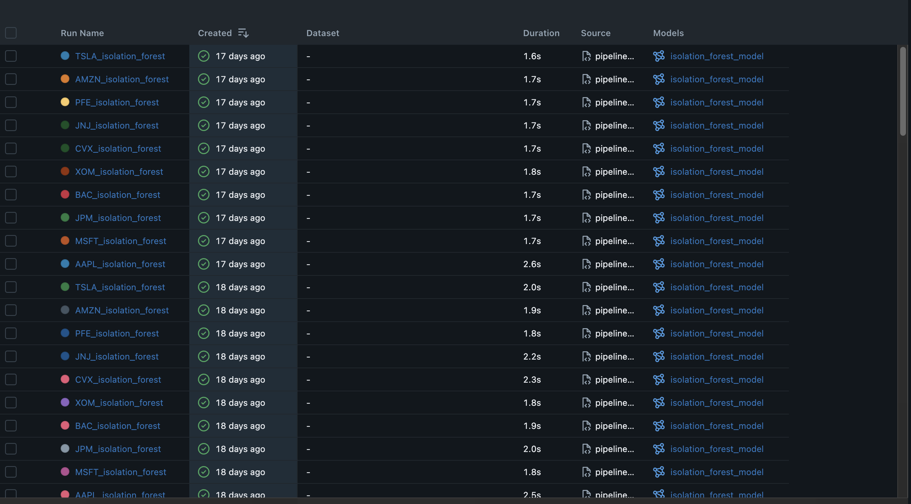

# 📈 Financial Anomaly Detector

> End-to-end MLOps pipeline for detecting anomalous stock behavior using
> Isolation Forest + R statistical validation, with automated drift monitoring
> and a live Streamlit dashboard.

[](https://financial-anomaly-detector-xxsfwbsuqkh8h3d2pynab3.streamlit.app)


---

## 🧩 Problem Statement

Institutional trading desks lose millions daily to undetected price anomalies, flash crashes, earnings surprises, and liquidity shocks that emerge too fast for manual review. This pipeline monitors 10 S&P 500 stocks in real time, cross-validating Python's Isolation Forest against R's time-series decomposition to surface only the highest-confidence alerts. Dual-model confirmation reduces false positives and mirrors how quantitative teams actually operate.

---

## 🏗️ Architecture



**Data flow:** yfinance → PostgreSQL → Feature Engineering → Isolation Forest + R anomalize → Alerts table → Streamlit dashboard

MLflow sits above the pipeline for experiment tracking and drift monitoring. Prefect orchestrates daily execution with retry logic and scheduling.

---

## 📊 Dashboard



**Live demo:** [financial-anomaly-detector.streamlit.app](https://financial-anomaly-detector-xxsfwbsuqkh8h3d2pynab3.streamlit.app)

---

## 🛠️ Tech Stack


| Tool | Role | Why chosen |
|------|------|------------|
| Python | Core pipeline + modeling | Industry standard for data science |
| R + anomalize | Statistical validation | Superior time-series decomposition vs Python |
| PostgreSQL | Data warehouse | Structured storage for prices, features, alerts |
| Isolation Forest | Anomaly detection | Unsupervised, no labeled data required |
| MLflow | Experiment tracking | Full model lineage and drift monitoring |
| Prefect | Orchestration | Scheduled daily pipeline with retry logic |
| Streamlit | Dashboard | Rapid deployment, live demo link |
| Docker | Containerization | One-command reproducibility |
| Supabase | Cloud PostgreSQL | Free tier, production-ready managed DB |

---

## 🔍 Dual-Validation Logic

The project's core insight is that single-model anomaly detection produces too many false positives to be actionable.

| Layer | Approach | Strength |
|-------|----------|----------|
| Python Isolation Forest | Multivariate ML across 4 features | Catches multi-dimensional patterns |
| R anomalize | Univariate time-series decomposition | Catches trend/seasonality-adjusted outliers |

When **both** flag the same date → high-confidence alert surfaced prominently in the dashboard. When only one flags it → worth investigating but not a primary alert. This mirrors how quant teams actually operate.

---

## ⚙️ MLflow Experiment Tracking



Every pipeline run logs parameters (`contamination`, `n_estimators`, `ticker`), metrics (`anomaly_count`, `anomaly_pct`, `drift_ks_statistic`, `drift_p_value`), and the serialized model artifact. The KS drift statistic tracks how much the anomaly score distribution shifts between retraining runs — a rising KS stat signals changing market behavior.

---

## 🔄 Prefect Orchestration



The pipeline runs daily at 4:30 PM EST on weekdays (market close) via a Prefect deployment. Tasks: ingest → feature engineering → model training → R validation. The ingest task has 2 retries with 30-second delays to handle yfinance rate limits.

---

## 🚀 How to Run Locally

```bash
git clone https://github.com/Mojo-TR/financial-anomaly-detector
cd financial-anomaly-detector
cp .env.example .env   # add your PostgreSQL credentials
docker-compose up --build
```

The container installs both Python and R dependencies and starts the Streamlit dashboard at `localhost:8501`.

To run the full pipeline manually:

```bash
python src/ingest.py
python src/features.py
python src/model.py
python src/validate_r.py
```

---

## 📁 Project Structure

```
financial-anomaly-detector/
├── src/
│   ├── ingest.py          # yfinance → PostgreSQL
│   ├── features.py        # Feature engineering
│   ├── model.py           # Isolation Forest + MLflow
│   └── validate_r.py      # R subprocess wrapper
├── r_scripts/
│   └── statistical_check.R  # anomalize pipeline
├── flows/
│   └── pipeline.py        # Prefect orchestration
├── dashboard/
│   └── app.py             # Streamlit dashboard
├── Dockerfile
├── docker-compose.yml
└── requirements.txt
```